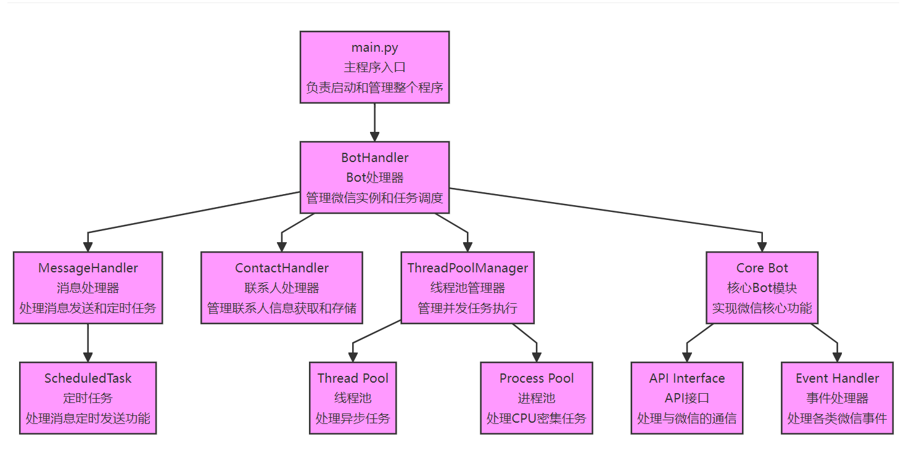

# WeChatMessageSender_Auto ——微信自动消息发送器

## 前言

本项目基于<a href="https://github.com/lyx102" rel="nofollow">**[lyx102](https://github.com/lyx102)**</a>大佬的项目<a href="https://github.com/lyx102/WeChatHook" rel="nofollow">**WeChatHook**</a>上进行二次开源、调整，再次向前辈表示敬佩！

[](https://opensource.org/licenses/MIT)

本项目采用 MIT 许可证。查看 [LICENSE](LICENSE) 文件了解更多详细信息。 MIT © [**WeChatMessageSender_Auto** ]

## 项目简介

​	**WeChatMessageSender_Auto**是一个基于 Python 的微信自动化工具，支持消息定时发送、联系人管理、自动回复等功能。该项目通过注入方式实现微信功能的自动化操作，提供了稳定可靠的接口和灵活的配置选项。

​	

## 一、功能特点
- ✨ 支持定时发送消息

- 📱 自动管理联系人信息

- 🔄 支持批量消息处理

- 🛡️ 线程安全的任务调度

- 📝 详细的日志记录

- 🎯 高效的并发处理

- 💾 数据持久化存储

  

## 二、项目架构


## 三、项目树

```
WeChatHook/
├── main.py                    # 主程序入口
├── wxhook/                    # 核心模块目录
│   ├── __init__.py           # 包初始化文件
│   ├── bot_handler.py        # Bot 处理器
│   ├── contact_handler.py    # 联系人处理器
│   ├── core.py              # 核心功能实现
│   ├── events.py            # 事件定义
│   ├── logger.py            # 日志处理
│   ├── messageBox.json      # 消息配置文件
│   ├── message_handler.py   # 消息处理器
│   ├── model.py            # 数据模型定义
│   ├── scheduler.py        # 调度器实现
│   ├── thread_pool.py      # 线程池管理
│   ├── time_handler.py     # 时间处理器
│   ├── utils.py           # 工具函数
│   └── tools/             # 工具目录
│       ├── config.ini     # 配置文件
│       ├── faker.exe      # 版本伪装工具
│       ├── start-wechat.exe # 微信启动工具
│       ├── wxhook.dll    # 注入模块
│       └── wxhook.json   # Hook 配置文件
```


## 四、使用方法

**▶1,**找到本地微信的安装文件夹，**将WeChat修改为其他任意英文名称**（不修改会与后续使用3.9.5版本微信冲突，导致本地微信文件夹被删除）

**▶2,**下载安装此微信版本到电脑中<a href="http://oss.zuoyu.top/WeChatSetup-3.9.5.81.exe" rel="nofollow">**WeChatSetup3.9.5.81.exe**</a>，浏览器会拦截，**选择保留信任此程序**，确保能够被下载下来

**▶3,**配置程序中**wxhook**文件夹中中的**messageBox.json**文件（发送消息的对象、内容、时间）

```json
{
    "messages": [
        {
            "wxid": "wxid_1",
            "message": "这是发给用户1的消息",
            "time": "23:30:00"  
        },
        {
            "wxid": "wxid_2",
            "message": "这是发给用户2的消息",
            "time": "2024-12-01 16:45:00" 
        },
        {
            "wxid": "filehelper",
            "message": "这是发给文件传输助手的消息",
            "time": "23:53:40"  
        }
    ]
}
```

**▶4,**根目录下运行：

```shell
pip install -r requirements.txt
```

**▶5,**根目录下运行：

```shell
python main.py -m
```


## 五、注意事项

**▶1,**程序首次运行会获取所有联系人信息到user_info文件夹中（若无则自动创建），为后续开发GUI界面进行铺垫

**▶2,**运行程序前最好将本地时间进行一下对时，以防因为某些原因造成本地时间与网络时间有差异！！！也可以自行开发一个time_sync进行程序时间校准

**▶3,**目前程序只实现了联系人信息获取 and 批量自定义定时发送信息，后续会接着二次开发更多的功能。


## 六、总结

​	新人初来乍到，欢迎各位大佬积极指正程序错误。
